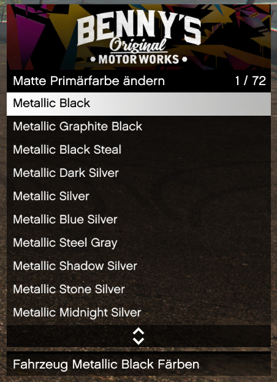
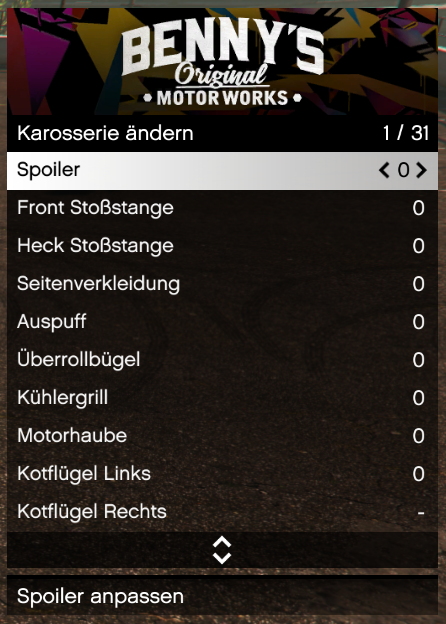
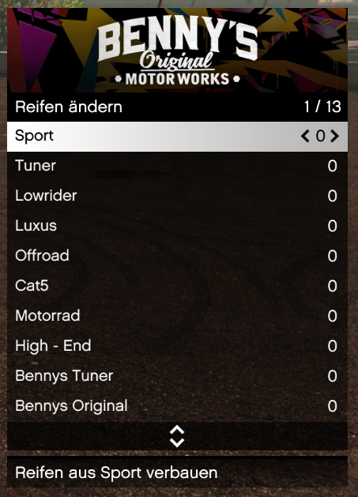

# Alt:V Native-UI Tunung Menü

Einfaches Tuning Menü Basierend auf dem NativeUI (siehe Credits) für Alt:V

## Features

- Farben von Lack, Reifen & Lichtern anpassen
- Karosserie & Leistungstuning
- Extras Anpassbar

## Installation

1. Ordner in das Resourcen verzeichniss von Alt:V kopieren
2. Resource in der server.toml hinzufügen

## Nutzung
- F5 drücken um das Menü zu öffnen (im Fahrzeug)

## Nutzungsbedingungen 
Gerne dürft ihr dieses Script auf eurem Server verwenden und auch einzelne Punkte in dem Script bearbeiten. Sollte jedoch jemand fragen woher das Script stammt ist auf mich zu verweisen! Schön wäre auch ein verweis auf mich in den Credits oder ähnlichem. Dies ist aber kein muss, würde mich aber freuen. 

Bei Fehlern Problemen oder sonstigem kontaktiert mich gerne per 
[Discord](https://discordapp.com/users/396472444388376577) oder per 
[GitHub](https://github.com/ExXTreMe315/native-tuner/issues)

## Kommentar
- Das Tuning Menü verfügt aktuell nicht über die Funktion Benutzerdefinierte farben zu verwenden, da Alt:V auf diesen keine Perleffekte unterstützt. Vielleicht kommen diese in einer späteren Version dies ist aber nicht zu 100% sicher.
- Mir ist bewusst, dass es vielleicht den einen oder anderen weg gibt um dieses Script zu verbessern oder einzelne Codestücke zu verkürtzen, ich selber lerne aber auch noch und weiß auch noch nicht alles über JS.

## Kontakt
- [Discord](https://discordapp.com/users/396472444388376577)

- [GitHub](https://github.com/ExXTreMe315)
- [GitHub Issues](https://github.com/ExXTreMe315/native-tuner/issues)

## Credits

- NativeUI: [DurtyFree](https://github.com/DurtyFree/alt-V-NativeUI) / [datWeazel](https://github.com/datWeazel/alt-V-NativeUI)

## Beispiel Bilder

